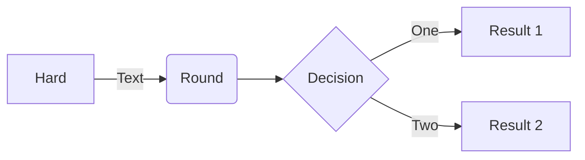

# UDS Pilot Link on Kubernetes

## Introduction
**UDS Pilot Link** is a Data Mover Service that runs in Kubernetes and can be instructed via the Lyve Pilot Cloud service to import/copy/export data between different types of storage.

The **UDS Pilot Link** platform consists of the following components:
1. The **UDS Pilot Link** deployment scripts and helm charts. Repo: [uds-deply-k8s](https://github.com/Seagate/uds-deploy-k8s) (this repo)
2. The **UDS Pilot Link Controller**, responsible for managing the **UDS Pilot Link Data Services**. Repo: [uds-ctrlr-k8s](https://github.com/Seagate/uds-ctrlr-k8s):
    - Deployment and Updates
    - Registration with Lyve Pilot 
    - Detection of storage
3. The **UDS Pilot Link Data Service**, responsible for connecting with the Lyve Pilot Cloud service and conducting requested data operations. Repo: [uds](https://github.com/Seagate/uds)

## Table of Contents

- [UDS Pilot Link on Kubernetes](#uds-pilot-link-on-kubernetes)
  - [Introduction](#introduction)
  - [Table of Contents](#table-of-contents)
  - [Building the containers](#building-the-containers)
    - [Building UDS Pilot Link Controller](#building-uds-pilot-link-controller)
    - [Building UDS Pilot Link Data Service](#building-uds-pilot-link-data-service)
  - [UDS Pilot Link on Kubernetes Prerequisites](#uds-pilot-link-on-kubernetes-prerequisites)
  - [Deploying Pilot Link on Kubernetes](#deploying-pilot-link-on-kubernetes)
    - [Labelling a Node for Storage Detection](#labelling-a-node-for-storage-detection)
    - [Defining Storage Detection in the UDS Pilot Link Controller Configuration File](#defining-storage-detection-in-the-uds-pilot-link-controller-configuration-file)
    - [Defining Auto Registration in the UDS Pilot Link Controller Configuration File](#defining-auto-registration-in-the-uds-pilot-link-controller-configuration-file)
    - [Defining a Storage Provisioner in the UDS Pilot Link Configuration File](#defining-a-storage-provisioner-in-the-uds-pilot-link-configuration-file)
    - [Setting the Container Registry and Container Version](#setting-the-container-registry-and-container-version)
    - [Deploying UDS Pilot Link](#deploying-uds-pilot-link)
  - [Modify a UDS Pilot Link Controller Configuration File on a Running Deployment](#modify-a-uds-pilot-link-controller-configuration-file-on-a-running-deployment)
  - [Updating the UDS Pilot Link Container Images in a Running Deployment](#updating-the-uds-pilot-link-container-images-in-a-running-deployment)
  - [Collecting Logs from a UDS Pilot Link Deployment](#collecting-logs-from-a-uds-pilot-link-deployment)
  - [Destroying a UDS Pilot Link Deployment](#destroying-a-uds-pilot-link-deployment)

## Building the containers
Two container are required, the **UDS Pilot Link Controller** and the **UDS Pilot Link Data Service**.

### Building UDS Pilot Link Controller
1. Clone [uds-ctrlr-k8s](https://github.com/Seagate/uds-ctrlr-k8s) repo:
   ```bash
   git@github.com:Seagate/uds-ctrlr-k8s.git
   ```
2. Build with the command (Replace `x.x.x` with the code version):
   ```bash
   docker build -f etc/docker/Dockerfile-pilot-link-ctrlr -t udspilotlinkds:1.7.0 .
   ```
3. Tag for pushing to your registry with the command (Replace `<myregistry>` with the registry you are using and `x.x.x` with the code version):
   ```bash
   docker tag udspilotlinkctrlr:1.7.0 <myregistry>/udspilotlinkctrlr:1.7.0
   ```
4. Push to your registry with the command (Replace `<myregistry>` with the registry you are using and `x.x.x` with the code version):
   ```bash
   docker push <myregistry>/udspilotlinkctrlr:1.7.0
   ```

### Building UDS Pilot Link Data Service
1. Clone [uds](https://github.com/Seagate/uds) repo:
   ```bash
   git@github.com:Seagate/uds.git
   ```
2. Build with the command (Replace `x.x.x` with the code version):
   ```bash
   docker build -f etc/docker/Dockerfile-pilot-link-ds -t udspilotlinkds:x.x.x .
   ```
3. Tag for pushing to your registry with the command (Replace `<myregistry>` with the registry you are using and `x.x.x` with the code version):
   ```bash
   docker tag udspilotlinkds:x.x.x <myregistry>/udspilotlinkds:x.x.x
   ```
4. Push to your registry with the command (Replace `<myregistry>` with the registry you are using and `x.x.x` with the code version):
   ```bash
   docker push <myregistry>/udspilotlinkds:x.x.x
   ```

## UDS Pilot Link on Kubernetes Prerequisites
1. **[Helm](https://helm.sh/)** **UDS Pilot Link** on Kubernetes is provided via Helm Charts. As such, you will need Helm installed locally on the master node to deploy **UDS Pilot Link** on Kubernetes. You can find the specific installation instructions for your local platform via the [Installing Helm](https://helm.sh/docs/intro/install/) section of the official Helm documentation.
2. Clone [uds-deply-k8s](https://github.com/Seagate/uds-deploy-k8s) (this repo) onto your Kubernetes master node:
   ```bash
   git@github.com:Seagate/uds-deploy-k8s.git
   ```

## Deploying Pilot Link on Kubernetes
**UDS Pilot Link** can be deployed on a single or multi node Kubernetes cluster.




### Labelling a Node for Storage Detection
If you want to use the **UDS Pilot Link** deployment to detect storage, you will need to label the node so the deployment can be assigned to the designated node

1. This example cluster has 4 nodes:

   ```bash
   kubectl get nodes
   ```
   ```bash
   NAME          STATUS   ROLES                  AGE    VERSION
   master-node   Ready    control-plane,master   186d   v1.23.3
   node-1        Ready    <none>                 186d   v1.23.3
   node-2        Ready    <none>                 186d   v1.23.3
   node-3        Ready    <none>                 186d   v1.23.3
   node-4        Ready    <none>                 158d   v1.23.3
   ```
2. We want to assign a deployment to `node-1`. We use the command `kubectl label nodes node-1 pilotLinkNodeLabel=detect1` set label of `pilotLinkNodeLabel` to the value `detect1` on `node-1`

3. We can see the label has been applied:
   ```bash
   kubectl get nodes node-1 --show-labels
   ```
   ```bash
   NAME     STATUS   ROLES    AGE    VERSION   LABELS
   node-1   Ready    <none>   186d   v1.23.3   beta.kubernetes.io/arch=amd64,beta.kubernetes.io/os=linux,kubernetes.io/arch=amd64,kubernetes.io/hostname=node-1,kubernetes.io/os=linux,pilotLinkNodeLabel=detect1,topology.jiva.openebs.io/nodeName=node-1
   ```
### Defining Storage Detection in the UDS Pilot Link Controller Configuration File
If you wan to use the **UDS Pilot Link** deployment to detect storage, you will need to create **UDS Pilot Link Controller** configuration file based off of [`pilot-link-ctrlr-config.json`](https://github.com/Seagate/uds-deploy-k8s/blob/UDX-7586_Pilot_Link_Pre_Release_Merge/cfg/pilot-link-ctrlr-config.json) and modify the `StorageCtrlrService` -> `storage_config` section. An example can be found at [`pilot-link-ctrlr-config-example.json`](https://github.com/Seagate/uds-deploy-k8s/blob/UDX-7586_Pilot_Link_Pre_Release_Merge/cfg/examples/pilot-link-ctrlr-config-example.json).

In this example we will configure a `pilot-link-ctrlr-config-detect1.json` configuration file for `node-1` label `pilotLinkNodeLabel=detect1` that assigns the following storage:
*  A ***VM Ware Virtial Disk*** as ***UDX*** storage 
*  A ***JetFlash Transcend 16GB*** USB device as ***UDX*** storage
*  All other USB devices as ***NON-UDX*** storage

We need to find the storage we want to use on `node-1`
   
1. ssh to node-1
   ```bash
   ssh root@node-1
   ```
2. List the devices by id:
   ```bash
   ls -l /dev/disk/by-id
   ```
   ```bash
   total 0
   lrwxrwxrwx 1 root root   9 Jan 26 12:29 ata-VMware_Virtual_IDE_CDROM_Drive_10000000000000000001 -> ../../sr0
   lrwxrwxrwx 1 root root  10 Jan 26 12:29 dm-name-centos-root -> ../../dm-0
   lrwxrwxrwx 1 root root  10 Jan 26 12:29 dm-name-centos-swap -> ../../dm-1
   lrwxrwxrwx 1 root root  10 Jan 26 12:29 dm-uuid-LVM-wVNfyM5epNvRmEdVQs2Ic6oRB2nNbyoASGGi92CMdympZbeL6qCR5O6YiPgOIIpJ -> ../../dm-0
   lrwxrwxrwx 1 root root  10 Jan 26 12:29 dm-uuid-LVM-wVNfyM5epNvRmEdVQs2Ic6oRB2nNbyoAtlhJ48seylccHlOrb9VWOkDT5AG4hS0K -> ../../dm-1
   lrwxrwxrwx 1 root root  10 Jan 26 12:29 lvm-pv-uuid-lNXqrM-l3IV-tZO5-54u5-u6zQ-q0s3-FYqHQS -> ../../sda2
   lrwxrwxrwx 1 root root   9 Jan 26 12:29 scsi-36000c29004bdd2fa35cf9768804944f0 -> ../../sda
   lrwxrwxrwx 1 root root  10 Jan 26 12:29 scsi-36000c29004bdd2fa35cf9768804944f0-part1 -> ../../sda1
   lrwxrwxrwx 1 root root  10 Jan 26 12:29 scsi-36000c29004bdd2fa35cf9768804944f0-part2 -> ../../sda2
   lrwxrwxrwx 1 root root   9 Jan 26 12:29 scsi-36000c291ae09f373e8c6809af3c8daad -> ../../sdf
   lrwxrwxrwx 1 root root   9 Jan 26 12:29 scsi-36000c2925d37e0bfe431d2b35716f8ab -> ../../sdc
   lrwxrwxrwx 1 root root   9 Jan 26 12:29 scsi-36000c294e0b5284a99a3313719c6a4e3 -> ../../sde
   lrwxrwxrwx 1 root root   9 Jan 26 12:29 scsi-36000c2962b122a6c3779e38cab08e146 -> ../../sdb
   lrwxrwxrwx 1 root root   9 Jan 26 12:29 scsi-36000c29a266f553d6d67703bef1036ed -> ../../sdd
   lrwxrwxrwx 1 root root   9 Feb 22 11:04 usb-JetFlash_Transcend_16GB_2822188912-0:0 -> ../../sdh
   lrwxrwxrwx 1 root root   9 Feb 22 11:04 usb-JetFlash_Transcend_4GB_I7NMP3IG-0:0 -> ../../sdg
   lrwxrwxrwx 1 root root   9 Jan 26 12:29 wwn-0x6000c29004bdd2fa35cf9768804944f0 -> ../../sda
   lrwxrwxrwx 1 root root  10 Jan 26 12:29 wwn-0x6000c29004bdd2fa35cf9768804944f0-part1 -> ../../sda1
   lrwxrwxrwx 1 root root  10 Jan 26 12:29 wwn-0x6000c29004bdd2fa35cf9768804944f0-part2 -> ../../sda2
   lrwxrwxrwx 1 root root   9 Jan 26 12:29 wwn-0x6000c291ae09f373e8c6809af3c8daad -> ../../sdf
   lrwxrwxrwx 1 root root   9 Jan 26 12:29 wwn-0x6000c2925d37e0bfe431d2b35716f8ab -> ../../sdc
   lrwxrwxrwx 1 root root   9 Jan 26 12:29 wwn-0x6000c294e0b5284a99a3313719c6a4e3 -> ../../sde
   lrwxrwxrwx 1 root root   9 Jan 26 12:29 wwn-0x6000c2962b122a6c3779e38cab08e146 -> ../../sdb
   lrwxrwxrwx 1 root root   9 Jan 26 12:29 wwn-0x6000c29a266f553d6d67703bef1036ed -> ../../sdd
   ```
   **Note:** the following devices:
   * `../../sdb` is the ***VM Ware Virtual Disk*** we want to use as ***UDX*** storage
   * `../../sdh` is the ***JetFlash Transcend 16GB*** USB device we want to use as ***UDX*** storage
   * `../../sdg` is an additional USB device we will use as ***NON-UDX*** storage
 
 ` `

3. List the devices by path:
   ```bash
   ls -l /dev/disk/by-path
   ```
   ```bash
   total 0
   lrwxrwxrwx 1 root root  9 Jan 26 12:29 pci-0000:00:07.1-ata-2.0 -> ../../sr0
   lrwxrwxrwx 1 root root  9 Jan 26 12:29 pci-0000:00:10.0-scsi-0:0:0:0 -> ../../sda
   lrwxrwxrwx 1 root root 10 Jan 26 12:29 pci-0000:00:10.0-scsi-0:0:0:0-part1 -> ../../sda1
   lrwxrwxrwx 1 root root 10 Jan 26 12:29 pci-0000:00:10.0-scsi-0:0:0:0-part2 -> ../../sda2
   lrwxrwxrwx 1 root root  9 Jan 26 12:29 pci-0000:00:10.0-scsi-0:0:1:0 -> ../../sdb
   lrwxrwxrwx 1 root root  9 Jan 26 12:29 pci-0000:00:10.0-scsi-0:0:2:0 -> ../../sdc
   lrwxrwxrwx 1 root root  9 Jan 26 12:29 pci-0000:00:10.0-scsi-0:0:3:0 -> ../../sdd
   lrwxrwxrwx 1 root root  9 Jan 26 12:29 pci-0000:00:10.0-scsi-0:0:4:0 -> ../../sde
   lrwxrwxrwx 1 root root  9 Jan 26 12:29 pci-0000:00:10.0-scsi-0:0:5:0 -> ../../sdf
   lrwxrwxrwx 1 root root  9 Feb 22 11:04 pci-0000:02:03.0-usb-0:1:1.0-scsi-0:0:0:0 -> ../../sdg
   lrwxrwxrwx 1 root root  9 Feb 22 11:04 pci-0000:02:03.0-usb-0:2:1.0-scsi-0:0:0:0 -> ../../sdh

   ```
   **Note:** the following devices:
   * `../../sdb` is the ***VM Ware Virtual Disk*** we want to use as ***UDX*** storage
   * `../../sdh` is the ***JetFlash Transcend 16GB*** USB device we want to use as ***UDX*** storage
   * `../../sdg` is an additional USB device we will use as ***NON-UDX*** storage
 
 ` `

4. Add the path filters
   
   The path filter define what devices the **UDS Pilot Link Controller** scans to look for storage devices.

   We add `".*usb-0.*-scsi-0:0.*"` to include all of the UDS devices and `".*pci-0000:00:10.0-scsi-0:0:1:0.*"` to include the specific ***VM Ware Virtual Disk***. The filters are standard regex.

   **Note:** `dev_exclude` can be used to exclude device paths. `dev_include` takes precedence over `dev_exclude`.

   **Note:** We want the `default_filesystem` to be `ext4` make sure you device is formatted with an `ext4` file system. `assignment_mode` is configured as `failover` so all storage is assigned to the first **UDS Pilot Link Data Service** and will be reassigned if the first fails.
    ```bash
    {
        "version": "2.0",
        "service_config": {
            "StorageCtrlrService": {
                "period": 5,
                "storage_config": {
                    "assignment_mode": "failover",
                    "default_filesystem": "ext4",
                    "dev_include": [
                        ".*usb-0.*-scsi-0:0.*",
                        ".*pci-0000:00:10.0-scsi-0:0:1:0.*"
                ],
                "dev_exclude": [
                    ".*"
                ]
            }
        }
    }
    ```
5. Add the device type mapping filters
   
   The device type mapping filters are used to define if the storage device is to be mapped as ***UDX*** or ***NON-UDX*** storage.

   We add the `vendor_id`, `product_id` and `serial_num` information for the ***VM Ware Virtual Disk*** and ***JetFlash Transcend 16GB*** USB device to the `udx` section and configure `non_udx` for all other devices.

   **Note:** The `vendor_id`, `product_id` and `serial_num` information are derived from the **List the devices by id** section.
   ```bash
   {
        "version": "2.0",
        "service_config": {
            "StorageCtrlrService": {
                "period": 5,
                "storage_config": {
                    "assignment_mode": "failover",
                    "default_filesystem": "ext4",
                    "dev_include": [
                        ".*usb-0.*-scsi-0:0.*",
                        ".*pci-0000:00:10.0-scsi-0:0:1:0.*"
                    ],
                    "dev_exclude": [
                        ".*"
                    ],
                    "dev_to_type_map": {
                        "udx": [
                            {
                                "vendor_id": "JetFlash",
                                "product_id": "Transcend 16GB",
                                "serial_num": "2822188912"
                            },
                            {
                                "vendor_id": "VMware,",
                                "product_id": "VMware Virtual S",
                                "serial_num": "c2962b122a6c3779e38cab08e146"
                            }   
                        ],
                        "non_udx": [
                            {
                                "vendor_id": ".*",
                                "product_id": ".*",
                                "serial_num": ".*"
                            }
                        ]
                    }
                }
            }
        }
    }
    ```

### Defining Auto Registration in the UDS Pilot Link Controller Configuration File

If you want the **UDS Pilot Link Controller** to automatically regsiter **UDS Pilot Link Data Services** with Lyve Pilot you need to provide details of you Lyve Pilot account in the `RegistrationCtrlrService` section of your configuration file. An example can be found at `pilot-link-ctrlr-config-example.json`.

**Note:** This section of the configuration file is in addition to the `StorageCtrlrService` section defined in [Defining Storage Detection in the UDS Pilot Link Controller Configuration File](#defining-storage-detection-in-the-uds-pilot-link-controller-configuration-file)

In this example we have configured the `auto_registration_mode` as `serial`. 

Options are: 
* `parallel` register discovered **UDS Pilot Link Data Services** without waiting for each to finish.
* `serial` wait for a **UDS Pilot Link Data Services** to complete registration before moving onto the next one.
* `off` do not auto register discovered **UDS Pilot Link Data Services**.

Provide the `api_url` and `username` of your Lyve Pilot account in the `'lp_account` section. For security, the password is requested at time of deployment, so it is not stored in a file.
```bash
{
    "version": "2.0",
    "service_config": {
        "RegistrationCtrlrService": {
            "auto_registration_mode": "serial",
            "lp_account": {
                "api_url": "https://api.lyve.seagate.com/accountuuid",
                "username": "my.email@mycompany.com"
            }
        }
    }
}
```

### Defining a Storage Provisioner in the UDS Pilot Link Configuration File

A storage provisioner can be used to define fixed storage volume claims for the **UDS Pilot Data Services** to use for ***NON-UDX*** and ***UDX*** storage.

Examples are:
* [Seagate CSI dynamic provisioner for Kubernetes](https://github.com/Seagate/seagate-exos-x-csi)
* [Rancher Local Path Provisioner](https://github.com/rancher/local-path-provisioner)

We will use [Rancher Local Path Provisioner](https://github.com/rancher/local-path-provisioner) in this example.

If you want the **UDS Pilot Link Data Services** to have storage allocated by a storage provisioner you need to provide details in the `DeployCtrlrService` section of your configuration file. An example can be found at `pilot-link-ctrlr-config-example.json`.

1.  Follow the instructions at [here](https://github.com/rancher/local-path-provisioner#deployment) to deploy Rancher Local Provisioner.
2.  Check the provisioner has been deployed with the following command:
    ```bash
    kubectl get storageclass
    ```
    ```bash
    NAME         PROVISIONER             RECLAIMPOLICY   VOLUMEBINDINGMODE      ALLOWVOLUMEEXPANSION   AGE
    local-path   rancher.io/local-path   Delete          WaitForFirstConsumer   false                  30h
    ```
3.  We want to allocate a ***NON-UDX*** volume of `10Gi` and a ***UDX*** volume of `20Gi` using the storage class `local-path` that corresponds to the Rancher Local Provisioner that is deployed. The `DeployCtrlrService` `storage_config` section should be updated as follows:
    ```bash
    {
        "version": "2.0",
        "service_config": {
            "RegistrationCtrlrService": {
                "period": 5,
                "num_data_services": 2,
                "storage_config": {
                    "udx": {
                        "size": "20Gi",
                        "storage_class": "local-path"
                    },
                    "non_udx": {
                        "size": "10Gi",
                        "storage_class": "local-path"
                    }
                }
            }
        }
    }
    ```
    **Note:** As `num_data_services` is set to `2`, this will result in 1 ***NON-UDX*** and 1 ***UDX*** volume being allocated to each of the 2 **UDS Pilot Link Data Services**. 
### Setting the Container Registry and Container Version
Before deploying **UDS Pilot Link** you need to set the container registry and container version for the **UDS Pilot Link Controller** and **UDS Pilot Link Data Service**. This is done by exporting the environment variables `PILOT_LINK_CTRLR_IMAGE` and `PILOT_LINK_DS_IMAGE`. Replace `<myregistry>` with the registry you are using and `x.x.x` with the code version:

```bash
export PILOT_LINK_CTRLR_IMAGE=<myregistry>/udspilotlinkctrlr:x.x.x
```
```bash
export PILOT_LINK_DS_IMAGE=<myregistry>/udspilotlinkds:x.x.x
```

### Deploying UDS Pilot Link
The `deploy_pilot_link.sh` script is used to deploy **UDS Pilot Link**. In this example we will deploy a **UDS Pilot Link Controller** and 2 **UDS Pilot Link Data Services** onto `node-1` on the Kubernetes cluster.

We set the namespace to the same as the label `detect1` that we put on `node-1` using the `-n` option. We enable storage detection with the `-d` option. We provide the configuration file `pilot-link-ctrlr-detect1-config.json` with the `-f` option.

**Note:** The script will ask for a password for the auto registration feature. The feature is not enabled for Lyve Pilot yet. We `echo notset` for the password to avoid the interactive prompt.

**Note:** Information on the all functions and usage is available by providing the `-h` option

Run the following command to deploy:
```bash
echo notset | uds-deploy-k8s/deploy_pilot_link.sh -n detect1 -d -f pilot-link-ctrlr-detect1-config.json
```
```bash
Enter your Lyve Pilot account password :
Creating detect1-pilot-link-ctrlr
NAME: detect1-pilot-link-ctrlr
LAST DEPLOYED: Tue Feb 22 13:22:18 2022
NAMESPACE: default
STATUS: deployed
REVISION: 1
TEST SUITE: None
```

Check that the deployment is ready by making sure all pods are up and running with the command:
```bash
 kubectl get pods -n detect1
```
You will see 1 `pilot-link-ctrlr` and 2 `pilot-link-ds` pods. Make sure that `READY` is `1/1` and `STATUS` is `Running`
```bash
NAME                                             READY   STATUS    RESTARTS   AGE
pilot-link-ctrlr-6b7745f8dd-7dh7c                1/1     Running   0          8m36s
pilot-link-ds1-686c747b6-2cs69                   1/1     Running   0          8m2s
pilot-link-ds2-74748f9f45-nx827                  1/1     Running   0          8m2s
```

## Modify a UDS Pilot Link Controller Configuration File on a Running Deployment
We will update the configuration file `pilot-link-ctrlr-config-detect1.json` created in section [Defining Storage Detection in the UDS Pilot Link Controller Configuration File](#defining-storage-detection-in-the-uds-pilot-link-controller-configuration-file) to assign the ***VM Ware Virtual Disk*** to be ***NON-UDX*** storage instead of ***UDX*** storage.

**Note:** If you have provided auto registration details as defined in section [Defining Auto Registration in the UDS Pilot Link Controller Configuration File](#defining-auto-registration-in-the-uds-pilot-link-controller-configuration-file) make sure this is present in the modified configuration file.

1. Remove the following from the `pilot-link-ctrlr-config-detect1.json` section `dev_to_type_map` As the device is not listed it will be assigned by the `non_udx` catch all configuration section:
   ```bash
   {   
        "vendor_id": "VMware,",
        "product_id": "VMware Virtual S",
        "serial_num": "c2962b122a6c3779e38cab08e146"
   } 
   ```
2. The configuration file should now be as follows for the `StorageCtrlrService` section:
   ```bash
   {
        "version": "2.0",
        "service_config": {
            "StorageCtrlrService": {
                "period": 5,
                "storage_config": {
                    "assignment_mode": "failover",
                    "default_filesystem": "ext4",
                    "dev_include": [
                        ".*usb-0.*-scsi-0:0.*",
                        ".*pci-0000:00:10.0-scsi-0:0:1:0.*"
                    ],
                    "dev_exclude": [
                        ".*"
                    ],
                    "dev_to_type_map": {
                        "udx": [
                            {
                                "vendor_id": "JetFlash",
                                "product_id": "Transcend 16GB",
                                "serial_num": "2822188912"
                            }
                        ],
                        "non_udx": [
                            {
                                "vendor_id": ".*",
                                "product_id": ".*",
                                "serial_num": ".*"
                            }
                        ]
                    }
                }
            }
        }
    }
    ```
3.  Modify the **UDS Pilot Link Controller** configuration
   
    We set the namespace to `detect1` using the `-n` option. We provide the configuration file `pilot-link-ctrlr-detect1-config.json` with the `-f` option.
    
    **Note:** Information on the all functions and usage is available by providing the `-h` option

    Run the following command:
    ```bash
    uds-deploy-k8s/modify_pilot_link.sh -n detect1 -f pilot-link-ctrlr-detect1-config.json
    ```
    ```bash
    Modifying the configuration for detect1/pilot-link-ctrlrconfigmap/pilot-link-ctrlr-cfg replaced
    Applying configuration to detect1/pilot-link-ctrlr
    deployment.apps/pilot-link-ctrlr restarted
    Configuration modification complete for detect1/pilot-link-ctrlr
    ```
    Check that the deployment is ready by making sure all pods are up and running with the command:
    ```bash
    kubectl get pods -n detect1
    ```
    You will see 1 `pilot-link-ctrlr` and 2 `pilot-link-ds` pods. Make sure that `READY` is `1/1` and `STATUS` is `Running`
    ```bash
    NAME                                             READY   STATUS    RESTARTS   AGE
    pilot-link-ctrlr-54cd6f58db-vknw4                1/1     Running   0          3m20s
    pilot-link-ds1-686c747b6-bt47c                   1/1     Running   0          14m
    pilot-link-ds2-74748f9f45-l7dxw                  1/1     Running   0          14m
    ```
    **Note:** You may see a additional `pilot-link-ctrlr` in the `Terminating` state as the configuration is modified.

## Updating the UDS Pilot Link Container Images in a Running Deployment
The `update_pilot_link.sh` script is used to udpate a previously deployed **UDS Pilot Link** deployment. In this example we will update the `detect1` deployment that we deployed in the [Deploying UDS Pilot Link](#deploying-uds-pilot-link) section.

We set the namespace to `detect1` using the `-n` option.

**Note:** Information on the all functions and usage is available by providing the `-h` option

1.  Follow section [Setting the Container Registry and Container Version](#setting-the-container-registry-and-container-version) to change the container image environment variables.
2.  Run the following command:
    ```bash
    uds-deploy-k8s/update_pilot_link.sh -n detect1
    ```
    ```bash
    Setting the Data Service image to 192.168.9.164:32000/udspilotlinkds:1.7.0
    Setting the image for detect1/pilot-link-ctrlr to 192.168.9.164:32000/udspilotlinkctrlr:1.0.0
    Waiting for the update to be rolled out for detect1/pilot-link-ctrlr
    .
    Update rollout was successful for detect1/pilot-link-ctrlr
    ```
    Check that the deployment is ready by making sure all pods are up and running with the command:
    ```bash
    kubectl get pods -n detect1
    ```
    You will see 1 `pilot-link-ctrlr` and 2 `pilot-link-ds` pods. Make sure that `READY` is `1/1` and `STATUS` is `Running`
    ```bash
    NAME                                             READY   STATUS    RESTARTS   AGE
    pilot-link-ctrlr-54cd6f58db-vknw4                1/1     Running   0          3m20s
    pilot-link-ds1-686c747b6-bt47c                   1/1     Running   0          14m
    pilot-link-ds2-74748f9f45-l7dxw                  1/1     Running   0          14m
    ```
    **Note:** You may see  additional `pilot-link-ctrlr` and `pilot-link-ds` in the `Terminating` state as the update is completed.

## Collecting Logs from a UDS Pilot Link Deployment
The `logs_pilot_link.sh` script is used to destroy a previously deployed **UDS Pilot Link** deployment. In this example we will update the `detect1` deployment that we deployed in the [Deploying UDS Pilot Link](#deploying-uds-pilot-link) section.

We set the namespace to `detect1` using the `-n` option.

**Note:** Information on the all functions and usage is available by providing the `-h` option

Run the command:
```bash
uds-deploy-k8s/logs_pilot_link.sh -n detect1
```
Logs will be collected and displayed in the terminal for `pilot-link-ctrlr` and `pilot-link-ds` that are in the deployment. You can redirect the output to a file using standard linux redirection.

## Destroying a UDS Pilot Link Deployment
The `destroy_pilot_link.sh` script is used to destroy a previously deployed **UDS Pilot Link** deployment. In this example we will destroy the `detect1` deployment that we deployed in the [Deploying UDS Pilot Link](#deploying-uds-pilot-link) section.

We set the namespace to `detect1` using the `-n` option.

**Note:** Information on the all functions and usage is available by providing the `-h` option

Run the following command to destroy the `detect1` deployment:
```bash
uds-deploy-k8s/destroy_pilot_link.sh -n detect1
```
```bash
Removing detect1-pilot-link-ctrlr
release "detect1-pilot-link-ctrlr" uninstalled
```
Check that the deployment has been destroyed by making sure the namespace has been removed with the command:
```bash
kubectl get namespace detect1
```
You will get the following response once the namespace has been removed:
```bash
Error from server (NotFound): namespaces "detect1" not found
```
